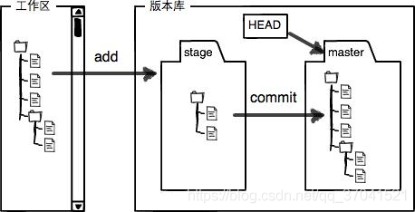
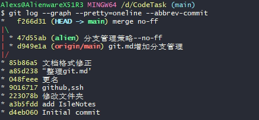
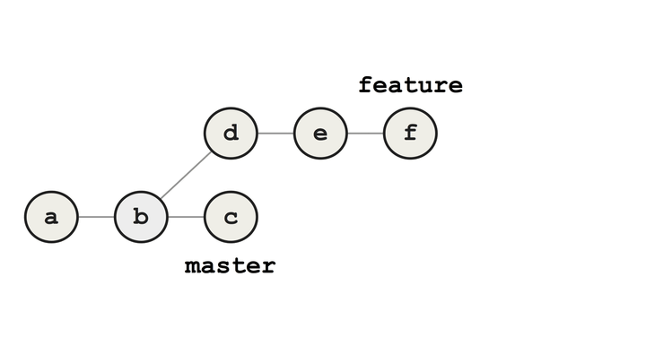
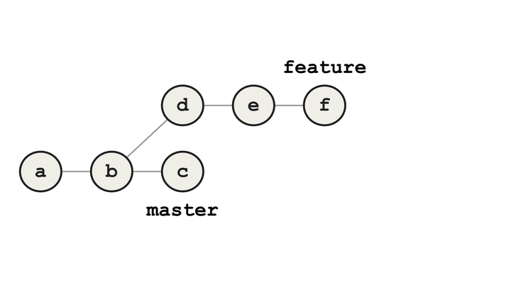

# git

## 终端命令

* $ `mkdir` 创建目录
* $ `pwd` 显示当前目录
* $ `rm` 删除文件
* $ `dir` 显示当期目录 （windows）

 ---

## 设置git的用户名邮箱

    1.git config --global user.name ""
    2.git config --global user.email ""

> `git config --list`查看git当前配置

## git命令

### 1.初始化仓库

`git init`
> 初始化仓库，将当前目录变成git可管理的仓库 | 版本控制系统只能跟踪文本文件的变化 | 在仓库目录下（或子目录）创建文件

### 2. 将文件添加到暂存区-stage

`git add <file>`

    1.git add file1.txt [文件1]
    2.git add file2.txt file3.txt [文件1 文件2 文件3]
    3.git add . [所有文件]
    4.git add --all  [所有文件]
    5.git code/*  [某目录(code)下所有文件]
    6.git code/*.md [某目录(code)下所有.md文件]
    7.git add code [code目录]

### 3.提交暂存区至当前分支

`git commit -m <message>`
> **把文件提交到仓库(当前分支main/hosp)，-m后面是本次提交的说明.**
 
 **vim**

> **git commit 不输入 -m <message>会进入vim模式**

1.vim两种工作模式

- 命令模式：接受执行vim命令（默认模式）
- 编辑模式：对打开的文件内容进行 增、删、改 操作；ESC 退回命令模式

2.创建、打开文件： `vi [filename]`

1. vi + 文件路径（或文件名）创建或打开已有文件
2. 输入‘i'或“Insert”键进入编辑模式

3.保存文件：

1. “ESC” 键，退出编辑模式
2. 在命令模式下键入"ZZ"或者":wq"保存修改并且退出 vim
3. 只想保存文件，则键入":w",停留在命令模式

4.放弃所有文件修改：

1. 放弃所有文件修改：按下 "ESC" 键进入命令模式，键入 ":q!" 回车后放弃修改并退出vi
2. 放弃所有文件修改，但不退出 vi ，按下 "ESC" 键进入命令模式，键入 ":e!" ，回车后回到命令模式。

### 4.显示当前分支状态

    git status

### 5.显示差异（difference)

> 工作区（working directory）->暂存区（index /stage）->本地仓库（repository）
>> git自动创建第一个 **master（main)** 分支，以及指向master(main)的 **head** 指针

- `git diff <file> `查看wording tree与index/stage的差异
- `git diff <file>` --cached 查看index/stage与repository的差异
- `git diff <file>`HEAD 查看working tree与repository的差异(HEAD代表最近一次commit的信息)

### 6.显示日志

    git log 显示从近到远的提交日志
    git log --pretty=oneline   一行显示，只显示哈希值和提交说明

> **head 指向当前分支（指针）**

### 7.版本切换

    git reflog 命令记录
    git reset --head <commit_id>

### 8.修改文件名

    git mv <old folder> <new folder>
    1. -v 显示信息
    2. -f 强制重命名或移动，会覆盖目标文件
    3. -k 跳过对重命名或移动出错的文件
    4. -n 只显示信息
    @只能修改已经追踪的文件，直接commit提交

### 9.撤销工作区的修改（un stage)

1. 未添加到stage `git checkout -- <file>`
2. 已添加到stage
    1. `git reset HEAD <file>`
    2. `git checkout -- <file>`
    3. 已提交至当前分支->参考[7.版本切换]前提是还未推送至远程库

#### 待更新（git checkout可替换命令 git switch 和 git restore

#### 删除文件

1.输入错误命令：`rm <file>`

1. 误删：`git checkout -- file`
2. 确定删除:
1. `git rm <file>`（从版本库中删除文件）

> 误删：

1.`git reset --hard`(将暂存区和工作区都恢复成指针指向分支的最新版本)

2.`git commit -m <message>`

1. `git log --pretty=oneline`查看之前提交的commit_id
2. `git reset --hard commit_id`
3. `git push origin HEAD --force` 提交当前HEAD

### 10.远程仓库(main主分支)

#### 1.添加

1. 关联远程仓库： `git remote add origin git@github:username:main.git`

2. 第一次推送main分支的所有内容：`git push -u origin main`

3. 推送最新修改：`git push origin main`

#### 2.clone远程仓库(main-主分支)

1. ssh:`git clone git@github.com:user/branch`
2. https:`git clone https://github.com/user/branch`

### 11.分支管理

> 平行宇宙:，当你正在电脑前努力学习Git的时候，另一个你正在另一个平行宇宙里努力学习SVN:

> > 在某个时间点，两个平行宇宙合并了，结果，你既学会了Git又学会了SVN！

> > > 

### 12. 创建与合并

##### 命令

1. 查看分支：`git branch`
2. 创建分支：`git branch <name>`
3. 切换分支：`git switch <name>`
4. 创建+切换分支：`git switch -c <name>`
5. 合并某分支到当前分支：` git merge <name>`
6. 删除分支：`git branch -d <name>`

> `head`指向当前分支

> 创建`dev`分支，git会创建一个`dev`指针，指向`master`相同的提交,再把`HEAD`指向`dev`,就表示当前在dev分支上，从现在开始，对工作区的修改和提交就是针对dev分支了，比如新提交一次后，dev指针往前移动一步，而master指针不变：

1.创建并切换到dev分支`git switch -c dev`
> 

2.`dev`上的工作完成时，就可以把dev合并到`master`上(把master指向dev的提交)

1. 切换回master分支`git switch master`
2. 合并 `git merge master`

> 

#### 2. 解决冲突

Git无法自动合并分支时，就必须首先解决冲突再合并。

1. `git log --graph`\
2. `git log --graph --pretty=oneline --abbrev-commit`

> 

#### 3. 分支管理策略

> 合并分支时，Git会用Fast forward模式，但这种模式下，删除分支后，会丢掉分支信息。 如果要强制禁用Fast forward模式，Git就会在merge时生成一个新的commit，这样 分支历史上就可以看出分支信息。

1. 强制禁用fastforward参数:`--no-f`
   ` git merge --no-ff -m"merge no-ff" alien`
   > Merge made by the 'recursive' strategy.
   > 
   > 查看分支历史:`git log`
2. 分支策略
   ##### 分支命名规则：

|  分支    |  命名规范  |         示例        |     备注     |
|:-------:|:---------:|:------------------:|:-----------:|
|**main** |   main    |      main/master    |   主分支    |
|**develop**|develop-***|develop-20200220v1.3 |以发布版本命名 |
| release |release-***|release-20200223v2.1 |以发布版本命名 |
| feature |feature-***|feature-userinfov2.1 |以主要功能点命名|
|  hotfix |hotfix-*** |hotfix-userQueryError|以修复功能命名 |

1. 主分支

> master：这个分支最为稳定，这个分支代表项目处于可发布的状态。

> develop：作为开发的分支，平行于master分支。

2. 支持分支

> Release：这个分支用来分布新版本,从develop分支创建，完成后合并回develop与master分支

> Feature：功能分支,必须从develop分支创建，完成后合并回develop分支
>> 丢弃一个没合并过的分支：`git branch -D <name>`        
> Hotfix ：这个分支主要为修复线上特别紧急的bug准备的。必须从**main**分支创建，完成后合并回**develop**与**master**分支。

> 

3. 常用命令

    1. 暂存当前工作： `git stash`(可多次保存)
        1. 带消息的 Git stash： `git stash save “Your stash message”`
        2. 存储没有追踪的文件: `git stash save -u`=`git stash save --include-untracked`
        3. stash差异总结： `git stash show`,只考虑和最近的 stash 比较
        4. stash 完整差异： `git stash show -p`
        5. 根据最近的 stash 创建一个新的分支,然后删除最近的 stash: `git stash branch <name> stash@{1}`
        6. 删除仓库中创建的所有的 stash: `git stash clear`
        7. 删除工作栈中最近的 stash,声明 stash id: `git stash drop stash@{1}`
    2. 查看暂存工作列表：`git stash list`
    3. 恢复工作区：`git stash apply stash@{0}`->stash内容并未删除，—>删除stash:`git stash drop`
    4. 恢复工作区同时删除stash:`git stash pop`
    5. 复制特定提交到当前分支：   `git cherry-pick <commit>`

### 13. 扩展： **git merge*与**git rebase**

> 将 feature 分支合并到 master 分支,创建一个新的提交 g 表示两个分支的合并

> ####1. merge 案例
>> 

在 merge 之前选择 rebase。提交会被移除，并且 feature 分支被重置到 master 分支，feature 分支上的提交被 重新应用到 master。差别在于这些重新应用的提交通常是原始的副本，它们的 SHA-1
值和原来的提交不一样。
> 2. ####rebase 案例
>> 
> > 将 feature 的基础提交从 b 变为了 c，这就是 rebase 的意思。将 feature 合并到 master 是一个快进合并，
> 因为在 feature 上的所有提交都是 master 的直接子代

#### 特例：

> 有一个依赖在 master 上被移除了，但在 feature 上还在使用。当 feature 分支 rebase 到 master 上时，第一个 重新应用的提交会打破你的构建，但只要没有合并冲突，rebase 就不会被中断。从第一个提交出现的错误会保留在随后的所有 提交中，这导致了一个链式的错误提交。这个错误只会在 rebase 完成后才会被发现，并且通常会在顶部增加一个修复 bug 的 提交 g
>> 

#### ... ...

### 14. 多人协作

从远程仓库克隆时，实际上Git自动把本地的`main`分支和远程的`main`分支对应起来了，并且，远程仓库的默认名称是`origin`

1. 查看远程库信息: `git remote`,显示详细信息：`git remote -v`
   如果没有推送权限，就看不到push地址
2. 推送分支： git push origin branch-name (将当前分支推送到远程分支)
    1. `main`分支是主分支，时刻与远程同步
    2. `dev`分支是开发分支，团队所有成员都需要在上面工作，所以也需要与远程同步；
    3. `bug`分支只用于在本地修复bug，就没必要推到远程了，除非老板要看看你每周到底修复了几个bug；
    4. `feature`分支是否推到远程，取决于是否和其他🐖合作在上面开发。
    5. 分支完全可以在本地自己藏着玩，是否推送，看心情！\
   #### *如果合并有冲突，则先解决冲突，并在本地提交*

3. 抓取dev分支：
    1. 在本地创建和远程分支对应的分支\
       `git switch -b branch-name origin/branch-name`
    2. 建立本地分支和远程分支的关联\
       `git branch --set-upstream branch-name origin/branch-name`
    3. 从远程抓取分支\
       `git pull`

### 15. tag标签

*标签总是和某个commit挂钩。如果这个commit既出现在master分支，又出现在dev分支，那么在这两个分支上都可以
看到这个标签。标签总是和某个commit挂钩。如果这个commit既出现在master分支，又出现在dev分支，那么在这两个 分支上都可以看到这个标签。*

1. 新建一个标签：`git tag <tagname>`,默认为`HEAD`,也可以指定一个`commit_id`;
2. 指定标签信息： `git tag -a <tagname> -m "lalalalalallalal`;
3. 查看所有标签： `git tag`
4. 查看tag说明文字： `git show <tag name>`
5. 删除本地标签： `git tag -d <tag name>`
6. 推送标签远程分支： `git push origin <tagname>`,一次性推送所有标签: `git push origin --tags`
7. 删除推送到远程的标签：
    1. 先从本地删除： `git tag -d <tagname>`
    2. 删除远程： `git push origin :refs/tags/<tagname>`

### 16. 自定义<.gitignore>

1.忽略特殊文件 在Git工作区的根目录下创建一个.gitignore文件，然后把要忽略的文件名填进去，Git就会自动忽略这些文件。

1. 创建`gitignore`文件： `touch .gitignore`
2. 查找配置文件：https://github.com/github/gitignore
   > 忽略文件的原则是：
    1. 忽略操作系统自动生成的文件，比如缩略图等；
    2. 忽略编译生成的中间文件、可执行文件等，也就是如果一个文件是通过另一个文件自动生成的，那自动生成的文件 就没必要放进版本库，比如Java编译产生的.class文件；
    3. 忽略敏感信息的配置文件，比如存放口令的配置文件。

3. 强制添加被忽略的文件： `git add -f <filename>`
4. `.gitignore`规则中添加例外：`!`+文件名

2.配置别名(alias)
--global参数是全局参数，也就是这些命令在这台电脑的所有Git仓库下都有用
1. status->st :`git config --global alias.st status`;
2. branch->br`git config --global alias.br branch`;
3. commit->ci`git config --global alias.ci commit`;
4. 把暂存区的修改撤销掉（unstage）： `git config --global alias.unstage 'reset HEAD'`\->
    ` git unstage test.py`\->`git reset HEAD test.py`
    
5. 用git last就能显示最近一次的提交：`git config --global alias.last 'log -1`
6. git config --global alias.lg "log --color --graph --pretty=format:'%Cred%h%Creset -%C(yellow)%d%Creset %s %Cgreen(%cr) %C(bold blue)<%an>%Creset' --abbrev-commit"

###17. 搭建git服务器

#### linux主机（ubuntu/)
1. 安装 `git`: `sudo apt-getinstall git`
2. 创建git用户(用来运行git服务)： `sudo adduser git`
3. 创建证书登录： 
    1.  收集用户公钥（id_rsa.pub)文件
    2.  导入公钥到`/home/git/.ssh/authorized_keys`文件里，一行一个。
    
4. 初始化git仓库：
    1.  选定目录（`rsv/example.git`）,在/srv目录下输入命令：
        `sudo git init --bare example.git`
        >Git就会创建一个裸仓库，裸仓库没有工作区，因为服务器上的Git仓库纯粹是为了共享，所以不让用户直接登录到服务器上去改工作区，并且服务器上的Git仓库通常都以.git结尾。
        
    2.  把owner改为git：`sudo chown -R git:git example.git`
5. 禁用shell登录：
   >出于安全考虑，第二步创建的git用户不允许登录shell，这可以通过编辑/etc/passwd文件完成。找到类似下面的一行：\
   `git:x:1001:1001:,,,:/home/git:/bin/bash`
   
    >改为：
    > `git:x:1001:1001:,,,:/home/git:/usr/bin/git-shell`\
   这样，git用户可以正常通过ssh使用git，但无法登录shell，因为我们为git用户指定的git-shell每次一登录就自动退出。
    
6. clone 远程仓库：
    >现在，可以通过git clone命令克隆远程仓库了，在各自的电脑上运行：
   `git clone git@server:/srv/example.git`
   
    >要方便管理公钥，用Gitosis；

    >要像SVN那样变态地控制权限，用Gitolite。
   

###18 SourceTree(免费Git图形界面工具)

https://www.sourcetreeapp.com/