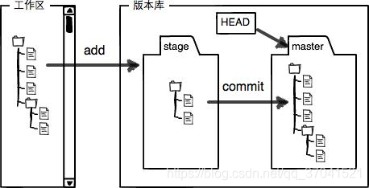

# git

## 终端命令

* $ mkdir 创建目录
* $ pwd 显示当前目录
* $ rm 删除文件
* $ dir 显示当期目录 （windows）

 ---

### git命令

git init --初始化仓库，将当前目录变成git可管理的仓库
> 版本控制系统只能跟踪文本文件的变化\
> 在仓库目录下（或子目录）创建文件

$ git add <file> 将文件添加到仓库(暂存区-stage)
> Unix的哲学是“没有消息就是好消息”

#### 把文件提交到仓库

    $ git commit -m <message>"说明" 
    告诉get，把文件提交到仓库(当前分支-master)，-m后面是本次提交的说明

#### git commit 可以一次提交多个文件

    * $ git add file1.txt
    * $ git add file2.txt file3.txt
    * $ git commit -m "add 3 files."

> git status 查看仓库状态（status：状态）
> git diff <file> 查看差异（difference)，格式是unix通用的diff格式

    git diff 比较工作目录中当前文件与暂存区快照之间的差异
    git diff --cached  查看工作区与head的不同

#### 日志

    $ git log 显示从近到远的提交日志
    $ git log --pretty=oneline   一行显示，只显示哈希值和提交说明

> head 当前版本（指针）

#### 版本回退

    $ git reset --head <commit_id>

#### 命令记录

    $ git reflog

#### 修改文件名

#### 修改文件夹名(git mv)

    $ git mv <old folder> <new folder>
    1. -v 显示信息
    2. -f 强制重命名或移动，会覆盖目标文件
    3. -k 跳过对重命名或移动出错的文件
    4. -n 只显示信息
    @只能修改已经追踪的文件，直接commit提交

#### 工作区（Work Directory)-版本库(Repository)

**Work Directory**->本地工作目录,其中的隐藏目录.git未Git的版本库
**Repostory-版本库**

> **stage(index)暂存区**\
> git自动创建第一个 **master** 分支，以及指向master的 **head** 指针

#### git 跟踪并管理的是修改，而非文件

    第一次修改->git add->第二次修改->git add ->git commit
    每次修改，如果不git add 到暂存区（stage),就不会加入到commit

#### 撤销修改

    git checkout -- <file> 

##### 撤销工作区的修改

    1.commit之前，已git add->修改已增加到到暂存区
        git reset HEAD <file>可以把暂存区的修改撤销（unstage),重新放回工作区

#### 待更新（git checkout可替换命令 git switch 和 git restore

#### 删除文件

    $ git rm <file>
    $ git commit

#### git add 多文件
1.所有文件

    1.git add .
    2.git add --all
2.某目录(code)下所有文件
    
    git code/*
3.某目录(code)下所有.md文件

    git code/*.md
4.文件夹

    git add 文件夹名

