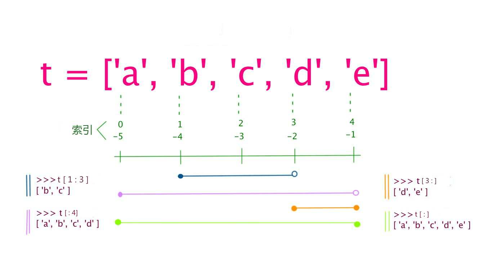

# 基本数据类型

---

Python 中的变量不需要声明。每个变量在使用前都必须赋值，变量赋值以后该变量才会被创建。

> 在 Python 中，变量就是变量，它没有类型，我们所说的"类型"是变量所指的内存中对象的类型。

等号（=）用来给变量赋值。

等号（=）运算符左边是一个变量名,等号（=）运算符右边是存储在变量中的值。

    counter = 100
    miles = 1000.0
    name = 'alien'

---

## 1. 多个变量赋值

Python允许同时为多个变量赋值:
> 创建一个整型对象，值为 `1`，从后向前赋值，三个变量被赋予相同的数值。
>> `a = b = c = 1`

也可以为多个对象指定多个变量
> 两个整型对象` 1` 和 `2` 的分配给变量 `a` 和 `b`，字符串对象` "robot"` 分配给变量 c
>> `a, b, c = 1, 2, 'robot'`

---

## 2. 标准数据类型

Python中有六个标准的数据类型：

- Number(数字)
- String（字符串）
- List(列表)
- Tuple(元祖)
- Set（集合）
- Dictionary（字典）

> 不可变：Number(数字）、String（字符串）、Tuple（元祖）

> 可变：List（列表）、Dictionary（字典）、Set（字典）

---

### 1. Number（数字）

Python3 支持 `int`、`float`、`bool`、`complex`（复数）

> 置的 `type()` 函数可以用来查询变量所指的对象类型

    a, b ,c ,d = 20, 5.5,  True, 4+3j
    print(type(a), type(b), type(c), type(4))
    <class 'int'> <class 'float'> <class 'bool'> <class 'int'>

> 还可以用 isinstance 来判断：

    a = True
    isinstance(a,bool)
    True

`isinstance` 和 `type` 的区别在于：

- `type()`不会认为子类是一种父类类型
- `isinstance`会认为子类是一种父类类型

        class A:
            pass
        class B(A):
            pass
        isinstance(A(),A)
        class A:
            pass
        class B(A):
            pass
        isinstance(A(),A)
        type(A()) == A
        True
        isinstance(B(),A)
        True
        type(B()) == A
        False

当你指定一个值时，Number 对象就会被创建：

    val1 = 1
    val2 = 2

使用del语句删除一些对象引用:

    del var1[,var2[,var3[....,varN]]]

可以通过使用del语句删除单个或多个对象:

    var1,var2,var3,var4,var5 = 1, 2, 3, 4, 5
    del var1
    del var2, var3, var4, var5

*数值运算*

    >>> 5 + 4  # 加法
    9
    >>> 4.3 - 2 # 减法
    2.3
    >>> 3 * 7  # 乘法
    21
    >>> 2 / 4  # 除法，得到一个浮点数
    0.5
    >>> 2 // 4 # 除法，得到一个整数
    0
    >>> 17 % 3 # 取余
    2
    >>> 2 ** 5 # 乘方
    32

*注意：*

1. Python可以同时为多个变量赋值，如`a, b = 1, 2`
2. 一个变量可以通过赋值指向不同类型的对象
3. 数值的除法包含两个运算符：`/` 返回一个浮点数;`//` 返回一个整数
4. 在混合计算时，Python会把整型转换成为浮点数

*数值类型实例*

|   int    |    float    |   complex    |
|:------:	|:----------:	|:----------:	|
|   10    |     0.0        |    3.14j    |
|   100    |    12.70    |    45.j        |
|  -789    |    -21.9    | 9.322e-36j    |
|   080    |  32.3e+18    |    .876j    |
|  -0127    |     -90        |  -6.54+0j    |
| -0x260    | -32.54e100    |   3e+26j    |
|  0x69    |  70.2e-12    |  5.34e-7j    |

> Python还支持复数，复数由实数部分和虚数部分构成，可以用`a + bj`,或者`complex(a,b)`表示， 复数的实部`a`和虚部`b`都是浮点型

---

### 2. String（字符串）

Python中的字符串用单引号 `'` 或 双引号 `" `括起来，同时使用反斜杠 `\` 转义特殊字符。

字符串的截取的语法格式如下：

    变量[头下标:尾下标]

索引值以 0 为开始值，-1 为从末尾的开始位置：

加号 `+` 是字符串的连接符， 星号 `*` 表示复制当前字符串，与之结合的数字为复制的次数:

    robot = 'google'
    print(robot)
    google
    print(robot[0:-1])
    googl
    print(robot[0])
    g
    print(robot[2:5])
    ogl
    print(robot[2:])
    ogle
    print(robot * 2)
    googlegoogle
    print(robot + 'TEST')
    googleTEST

> Python 使用反斜杠 `\`转义特殊字符，如果你不想让反斜杠发生转义，可以在字符串前面添加一个 `r`，表示原始字符串：

    print('go\nogle')
    go
    ogle
    print(r'go\nogle')
    go\nogle

> 另外，反斜杠()可以作为续行符，表示下一行是上一行的延续。也可以使用 `"""`...`"""` 或者 `'''`...`''' `跨越多行

> Python 没有单独的字符类型，一个字符就是长度为1的字符串。

> 与 C 字符串不同的是，Python 字符串不能被改变。
>> 向一个索引位置赋值，比如`word[0] = 'm'`会导致错误。

**注意：**

1. 反斜杠可以用来转义，使用r可以让反斜杠不发生转义。
2. 字符串可以用+运算符连接在一起，用*运算符重复。
3. Python中的字符串有两种索引方式，从左往右以0开始，从右往左以-1开始。
4. Python中的字符串不能改变。

---

### 3. List(列表)

List（列表） 是 Python 中使用最频繁的数据类型

列表可以完成大多数集合类的数据结构实现。列表中元素的类型可以不相同，它支持数字，字符串甚至可以包含列表（所谓嵌套）。

> 列表是写在方括号 `[]` 之间,用逗号分隔开的元素列表

和字符串一样，列表同样可以被索引和截取，列表被截取后返回一个包含所需元素的新列表

列表截取的语法格式如下：

    变量[头下标:尾下标]

索引值以 0 为开始值，-1 为从末尾的开始位置:

加号 + 是列表连接运算符，星号 * 是重复操作。

    list = [ 'abcd', 786 , 2.23, 'runoob', 70.2 ]
    tinylist = [123, 'runoob']
    
    print (list)            # 输出完整列表
    print (list[0])         # 输出列表第一个元素
    print (list[1:3])       # 从第二个开始输出到第三个元素
    print (list[2:])        # 输出从第三个元素开始的所有元素
    print (tinylist * 2)    # 输出两次列表
    print (list + tinylist) # 连接列表

> 与Python字符串不一样的是，列表中的元素可以改变：

    >>> a = [1, 2, 3, 4, 5, 6]
    >>> a[0] = 9
    >>> a[2:5] = [13, 14, 15]
    >>> a
    [9, 2, 13, 14, 15, 6]
    >>> a[2:5] = []   # 将对应的元素值设置为 []
    >>> a
    [9, 2, 6]

> List 内置了有很多方法，例如 append()、pop() 等

- List写在方括号之间，元素用逗号隔开。
- 和字符串一样，list可以被索引和切片
- List可以使用+操作符进行拼接
- List中的元素是可以改变的

> Python 列表截取可以接收第三个参数，参数作用是截取的步长。

以下实例在索引 1 到索引 4 的位置并设置为步长为 2（间隔一个位置）来截取字符串：

    last = [0,1,2,3,4,5,6,7,8,9]
    print(last[1:9:2])
    [1, 3, 5, 7]
    print(last[1:10:2])
    [1, 3, 5, 7, 9]
    print(last[1:10:1])
    [1, 2, 3, 4, 5, 6, 7, 8, 9]
    print(last[0:10:2])
    [0, 2, 4, 6, 8]

> 如果第三个参数为负数表示逆向读取

[reversewords.py](../test/reversewords.py)

### 4. Tuple（元组）

元组（tuple）与列表类似，不同之处在于元组的元素不能修改.

元组写在小括号 `()` 里，元素之间用逗号隔开。

元组中的元素类型也可以不相同：

tuple = ( 'abcd', 786 , 2.23, 'runoob', 70.2  )
tinytuple = (123, 'runoob')

    print (tuple)             # 输出完整元组
    print (tuple[0])          # 输出元组的第一个元素
    print (tuple[1:3])        # 输出从第二个元素开始到第三个元素
    print (tuple[2:])         # 输出从第三个元素开始的所有元素
    print (tinytuple * 2)     # 输出两次元组
    print (tuple + tinytuple) # 连接元组

元组与字符串类似，可以被索引且下标索引从0开始，-1 为从末尾开始的位置

> 可以把字符串看作一种特殊的元组

    tup = (1,2,3,4,5,6)
    print(tup[0])
    1
    print(tup[1:5])
    (2, 3, 4, 5)
    tup[0] = 11  # 修改元组元素的操作是非法的
    Traceback (most recent call last):
      File "<input>", line 1, in <module>
    TypeError: 'tuple' object does not support item assignment

> 虽然tuple的元素不可改变，但它可以包含可变的对象，比如list列表：
>> `tup1 = () `   # 空元组

> 构造包含 0 个或 1 个元素的元组比较特殊，所以有一些额外的语法规则：
>> `tup2 = (20,) `# 一个元素，需要在元素后添加逗号

**string、list、tuple 都属于sequence（序列）**
*注意：*

- 与字符串一样，元祖的元素不能修改
- 元祖也可以被索引和切片，方法一样
- 注意构造包含0和1个元素的元祖的特殊语法规则
- 元祖也可以使用+操作符进行拼接

### 5. Set(集合）

集合（set)）是由一个或数个形态各异的大小整体组成的，构成集合的事物或对象称作元素或是成员
> 基本功能是进行成员关系测试和删除重复元素

可以使用`{}`或者set()函数创建集合

*注意：*创建一个空集合必须用`set()`而不是`{}`，因为`{}`是用来创建一个空字典。

创建格式： parame = {value1,value2,value3,...} 或者 set(value)

