# 字符串

---

字符串是 Python 中最常用的数据类型。我们可以使用引号( `'` 或 `"` )来创建字符串

创建字符串很简单，只要为变量分配一个值即可

    var1,var2 = 1 , 2

## 1. 访问字符串中的值

Python 不支持单字符类型，单字符在 Python 中也是作为一个字符串使用

Python 访问子字符串，可以使用方括号 [] 来截取字符串，字符串的截取的语法格式如下：

    变量[头下标:尾下标]

> 索引值以 0 为开始值，-1 为从末尾的开始位置

    var1 = "Hello World!"
    var2 = "google"
    var1[0]
    'H'
    var2[1:5]
    'oogl'

---

## 2. 字符串更新

截取字符串的一部分并与其他字段拼接

    var1 = 'hello word!'
    print("已更新字符串:",var1[:6]+"google")
    已更新字符串: hello google

---

## 3. 转义字符

需要在字符中使用特殊字符时，python 用反斜杠`\`转义字符:

| **转义字符** | **描述**                                           | **实例**                                                                                                |
|----------|--------------------------------------------------|-------------------------------------------------------------------------------------------------------|
| \(在行尾时)  | 续行符                                              | print("line1\ ...line2\ ...line3") line1 line2 line3                                         |
| \\       | 反斜杠符号                                            | print("\\")                                                                                           |
| \'       | 单引号                                              | print("\'")                                                                                           |
| \''      | 双引号                                              | print("\"")                                                                                           |
| \a       | 响铃                                               | print("\a")                                                                                           |
| \b       | 退格(backspace)                                    | print("Hello \b World")                                                                               |
| \000     | 空                                                | print("\000")                                                                                         |
| \n       | 换行                                               | print("\n")                                                                                           |
| \v       | 纵向制表符                                            | print("Hello \v World")                                                                               |
| 	        | 横向制表符                                            | print("Hello 	 World")                                                                                |
| \r       | 回车,将\r后面的内容移到字符串开头,并逐一替换开头部分的字符,直至将\r后面的内容完全替换完成 | print("Hello \rWorld!") World! print("google runoob taobao \r 123456") 123456 runoob taobao  |
| \f       | 换页                                               | print("Hello World")                                                                                  |
| \yyy     | 八进制数,y代表0~7的字符,例如:\012代表换行                       |  print("\110\145\154\154\157\40\127\157\162\154\144\41") Hello World!                              |
| \xyy     | 十六进制数，以 \x 开头，y 代表的字符，例如：\x0a 代表换行               | print("\x48\x65\x6c\x6c\x6f\x20\x57\x6f\x72\x6c\x64\x21") Hello World!                             |

## 4. 字符串运算符

> 变量 a 值为字符串 "Hello"，b 变量值为 "Python"：

| **操作符** | **描述**                                                                                                 | **实例**                           |
|:-------:|:------------------------------------------------------------------------------------------------------:|:--------------------------------:|
| +       | 字符串连接                                                                                                  | a + b 输出结果: HelloPython          |
| *       | 重复输出字符串                                                                                                | a*2输出结果:HelloHello               |
| []      | 通过索引获取字符串中字符                                                                                           | a[1]输出结果:e                       |
| [:]     | 截取字符串中的一部分,遵循左闭右开 原则,str[0:2]是不包含第三个字符的                                                                 | a[1:4]输出结果:ell                   |
| in      | 成员运算符 - 如果字符串中包含给定的字符返回 True                                                                           | 'H' in a 输出结果 True               |
| not in  | 成员运算符 - 如果字符串中不包含给定的字符返回 True                                                                          | 'M' not in a 输出结果 True           |
| r/R     | 原始字符串 - 原始字符串：所有的字符串都是直接按照字面的意思来使用，没有转义特殊或不能打印的字符。 原始字符串除在字符串的第一个引号前加上字母 r（可以大小写）以外，与普通字符串有着几乎完全相同的语法。 | print( r'\n' ) print( R'\n' ) |
| %       | 格式字符串                                                                                                  |                                  |

    a = "Hello"
    b = "Python"

    print("a + b 输出结果：", a + b)
    print("a * 2 输出结果：", a * 2)
    print("a[1] 输出结果：", a[1])
    print("a[1:4] 输出结果：", a[1:4])

    if( "H" in a) :
        print("H 在变量 a 中")
    else :
        print("H 不在变量 a 中")

    if( "M" not in a) :
        print("M 不在变量 a 中")
    else :
        print("M 在变量 a 中")

    print (r'\n')
    print (R'\n')

## 5. 字符串格式化

Python 支持格式化字符串的输出 。尽管这样可能会用到非常复杂的表达式，但最基本的用法是将一个值插入到一个有字符串格式符 `%s` 的字符串中。

    print("我叫 %s 今年 %d岁!"% ('小明' , 10))
    我叫 小明 今年 10岁!

### 1.字符串格式化符号:

| **符   号** | **描述**             |
|:---------:|:------------------:|
| %c        | 格式化字符及其ASCII码      |
| %s        | 格式化字符串             |
| %d        | 格式化整数              |
| %u        | 格式化无符号整形           |
| %o        | 格式化无符号八进制数         |
| %x        | 格式化无符号十六进制数        |
| %X        | 格式化无符号十六进制数(大写)    |
| %f        | 格式化浮点数字,可指定小数点后的精度 |
| %e        | 用科学计数法格式化浮点数       |
| %E        | 作用同%e,用科学计数法格式化浮点数 |
| %g        | %f和%e的简写           |
| %G        | %f和%E的简写           |
| %p        | 用十六进制              |

### 2. 格式化操作符辅助指令:

| **符号** | **功能**                                              |
|:------:|:---------------------------------------------------:|
| *      | 定义宽度或者小数点精度                                         |
| -      | 用做左对齐                                               |
| +      | 在正数前面显示加号( + )                                      |
| <sp>   | 在正数前面显示空格                                           |
| #      | 在八进制数前面显示零('0')，在十六进制前面显示'0x'或者'0X'(取决于用的是'x'还是'X') |
| 0      | 显示的数字前面填充'0'而不是默认的空格                                |
| %      | '%%'输出一个单一的'%'                                      |
| (var)  | 映射变量(字典参数)                                          |
| m.n.   | m 是显示的最小总宽度,n 是小数点后的位数(如果可用的话)                      |

> 2.6 开始，新增了一种格式化字符串的函数 `str.format()`，它增强了字符串格式化的功能。

## 6. 三引号

 三引号允许一个字符串跨多行，字符串中可以包含换行符、制表符以及其他特殊字符。

     para_str = '''这是一个多行字符串的实例
    ... 多行字符串可以使用制表符
    ... TAB(\t).
    ... 也可以使用换行符[\n].
    ... '''
     print(para_str)

    >>>这是一个多行字符串的实例
    多行字符串可以使用制表符
    TAB(    ).
    也可以使用换行符[
    ].

> 三引号让程序员从引号和特殊字符串的泥潭里面解脱出来，自始至终保持一小块字符串的格式是所谓的`WYSIWYG`（所见即所得）格式的。

>一个典型的用例是，当你需要一块HTML或者SQL时，这时用字符串组合，特殊字符串转义将会非常的繁琐。

## 7. f-string

`f-string` 字面量格式化字符串，是新的格式化字符串的语法。

`f-string`以`f`开头,后面跟着字符串字符串中表达式用大括号`{}`括起来,它会将变量或表达式计算后的值替换进去.

    
